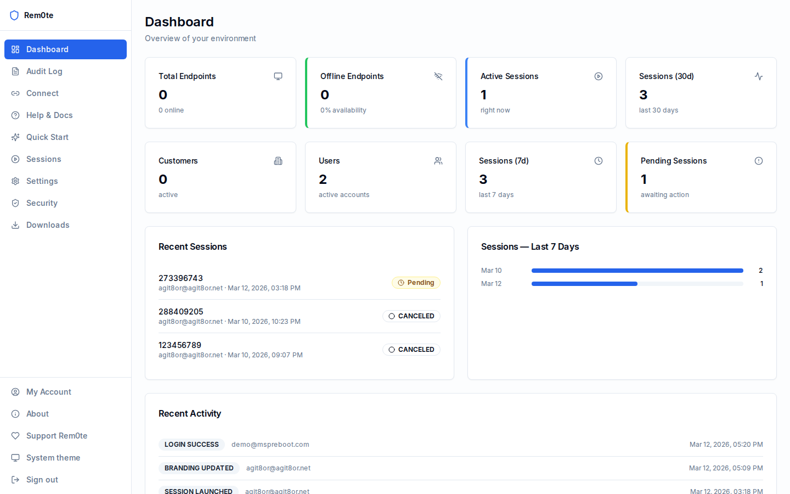
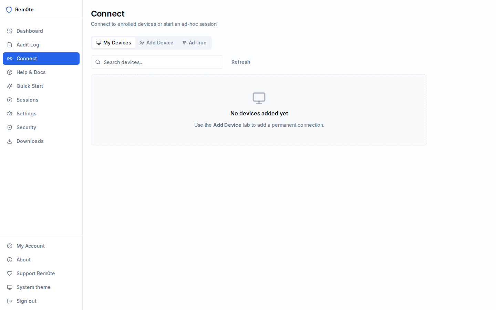
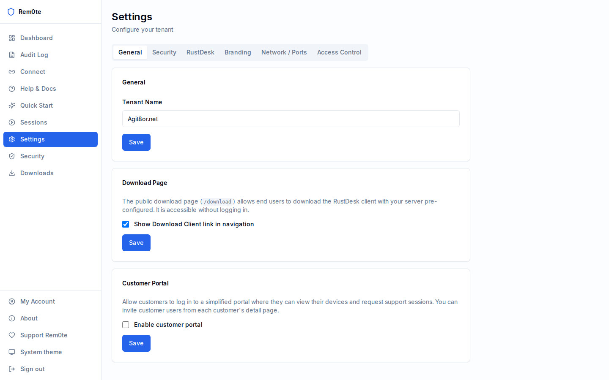
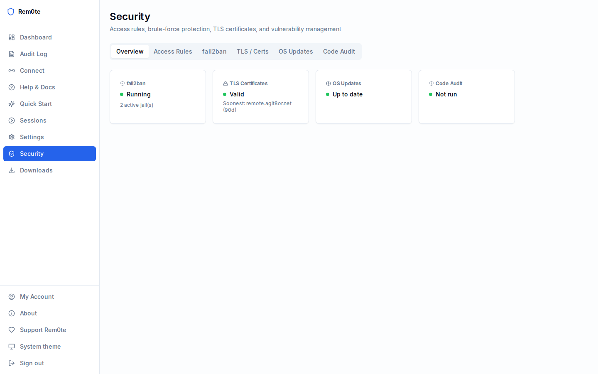
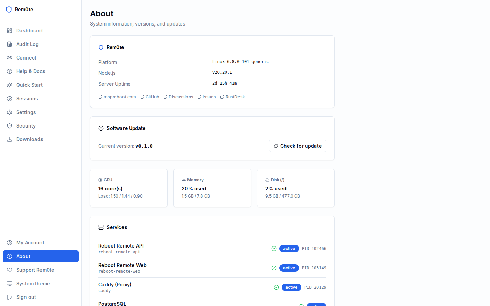

# Rem0te 🐾

> Multi-tenant remote support management platform built on [RustDesk](https://rustdesk.com).
> Managed by **Luna** — a very good German Shepherd Dog.

[](https://github.com/agit8or1/rem0te/releases)
[](https://github.com/agit8or1/rem0te/issues)
[](LICENSE)
[](https://mspreboot.com)

---

## Screenshots

| Dashboard | Connect |
|-----------|---------|
|  |  |

| Settings | Security |
|----------|----------|
|  |  |

| About & Updates | Branding |
|-----------------|----------|
|  |  |

---

## What is Rem0te?

Rem0te wraps the open-source RustDesk server (`hbbs` + `hbbr`) with a full multi-tenant management layer. Support teams get a polished dashboard to manage customers, devices, sessions, and permissions — without touching RustDesk internals.

**Key features:**
- 🖥️ **Permanent on-demand connections** — enroll devices once, connect any time with one click
- 👥 **Multi-tenant** — separate workspaces per organisation, full role hierarchy
- 🔐 **MFA / TOTP** — with recovery codes
- 👤 **Customer portal** — self-service support requests for end users
- 📋 **Audit log** — every session and action recorded
- 🛡️ **Security panel** — fail2ban management, OS updates, TLS renewal
- 📦 **Auto-configured install scripts** — Windows/Linux/macOS one-liners that configure and register devices
- 🔄 **Self-update** — check and apply updates from this repo with real-time progress

---

## Stack

| Layer | Tech |
|-------|------|
| API | NestJS + Prisma + PostgreSQL + Redis |
| Web | Next.js 14 App Router + shadcn/ui + TanStack Query |
| Desktop launcher | Tauri 2.0 |
| Remote transport | RustDesk hbbs / hbbr |
| Deploy | Systemd on Ubuntu (no Docker) |

---

## Quick Start

See [docs/setup.md](docs/setup.md) for full installation instructions.

```bash
# Clone
git clone https://github.com/agit8or1/rem0te
cd rem0te

# Install deps
pnpm install

# Configure
cp apps/api/.env.example apps/api/.env
# Edit apps/api/.env with your database, JWT secrets, etc.

# Build
pnpm --filter api build
pnpm --filter web build

# Run
sudo systemctl start rem0te-api rem0te-web
```

---

## Contributing

Issues, ideas, and pull requests are welcome.

- 🐛 [Report a bug](https://github.com/agit8or1/rem0te/issues/new?template=bug_report.md)
- 💡 [Request a feature](https://github.com/agit8or1/rem0te/issues/new?template=feature_request.md)
- 💬 [Join the discussion](https://github.com/agit8or1/rem0te/discussions)

---

## Project Manager

This project is overseen by **Luna**, a German Shepherd Dog of exceptional intelligence and discerning taste in remote support software. All major decisions are reviewed by Luna before merging.

🐾

---

## Support This Project

If Rem0te saves you time, consider supporting its development:

- ⭐ [Star on GitHub](https://github.com/agit8or1/rem0te)
- 💖 [GitHub Sponsors](https://github.com/sponsors/agit8or1)
- ☕ [Buy Me a Coffee](https://www.buymeacoffee.com/agit8or1)
- 🍵 [Ko-fi](https://ko-fi.com/agit8or1)

---

## License

MIT — see [LICENSE](LICENSE)
