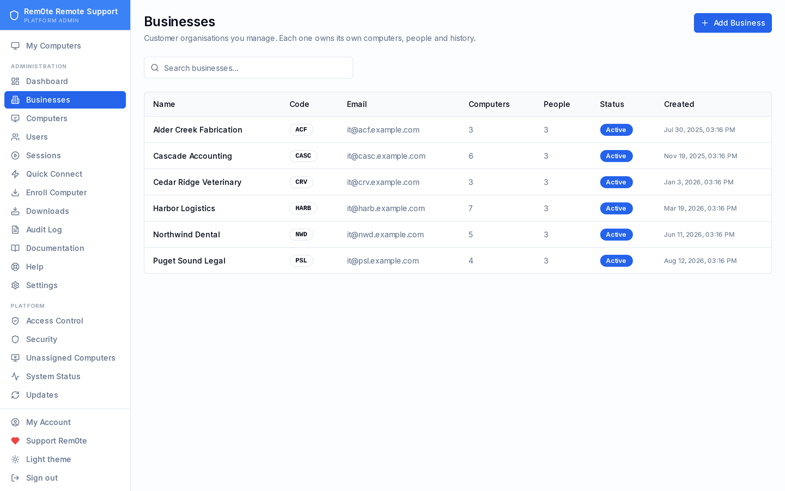
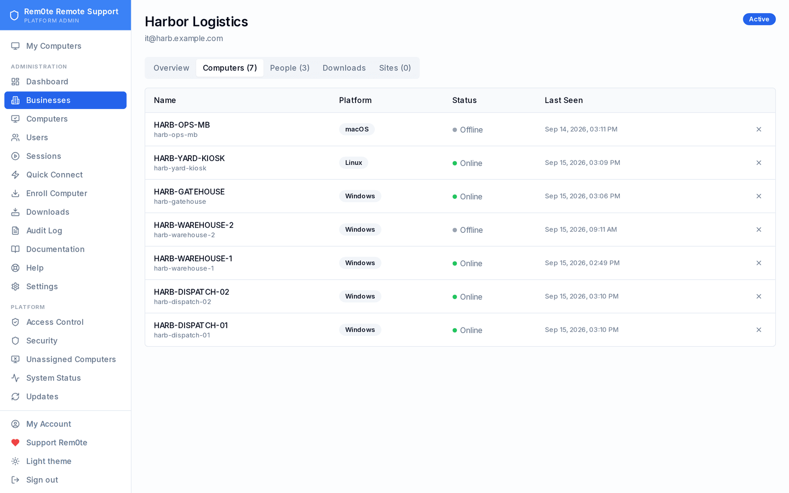
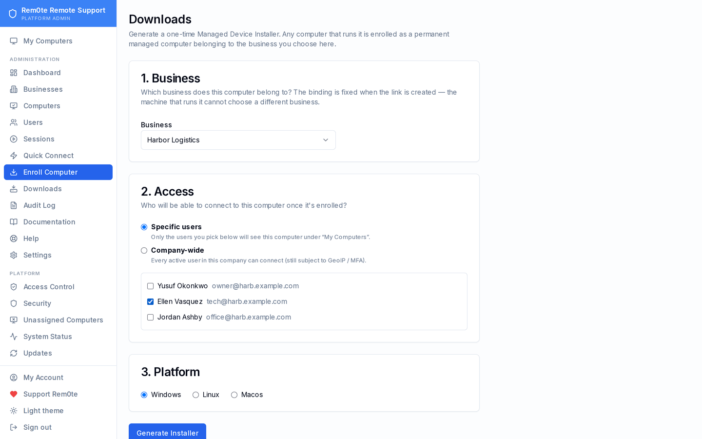
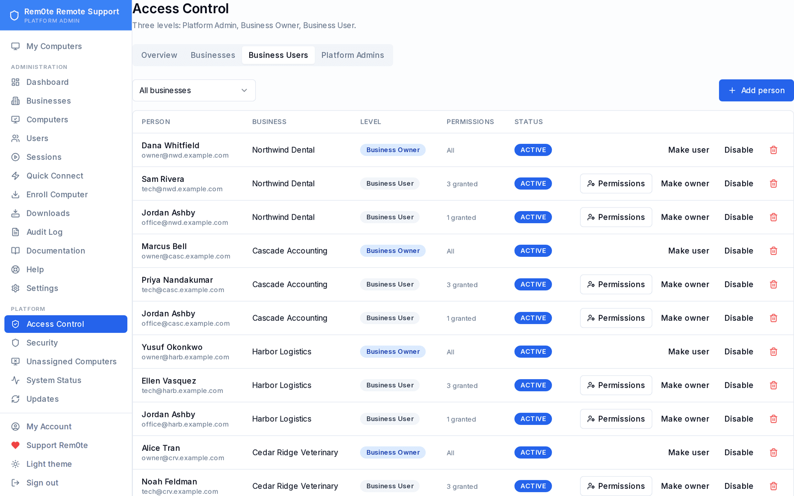
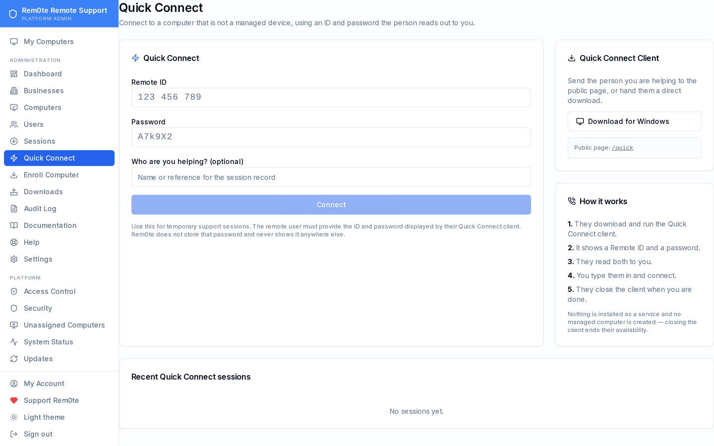
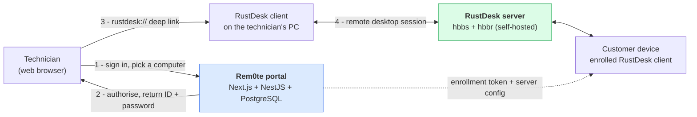

<div align="center">

# Rem0te

**Self-hosted remote support for customer businesses, powered by RustDesk.**

One operator, many customer businesses — each with its own computers, its own people,
and its own history. Rem0te is the portal around a self-hosted RustDesk server that
keeps them organised and separate.

[](https://github.com/agit8or1/rem0te/actions/workflows/ci.yml)
[](https://github.com/agit8or1/rem0te/releases)
[](LICENSE)
[](https://github.com/agit8or1/rem0te/stargazers)
[](https://github.com/agit8or1/rem0te/issues)

[Screenshots](#screenshot-tour) · [Quick start](#quick-start) · [Architecture](docs/architecture.md) · [Security](#security) · [Releases](https://github.com/agit8or1/rem0te/releases)

</div>

---



<sub><i>The operator's view: every customer business, with its computer and people counts at a glance. <a href="docs/images/github/hero-businesses.png">View full size</a></i></sub>

---

## Why it helps

**Every customer's computers in one place.** No spreadsheet of RustDesk IDs, no
"which machine was that again?". Computers are grouped by the business that owns
them, with platform, online state and last-seen time in the list.

**Connect without passing passwords around.** A technician clicks **Connect**;
Rem0te authorises the request, fetches the machine's credentials and hands them to
the RustDesk client on the technician's own PC. The password is never typed,
e-mailed, or kept in a shared note — and every reveal is written to the audit log.

**Give each person exactly the access they need.** A business owner decides who may
see which computers and what they may do — connect, enrol, manage people, view
history — without the operator being in the loop for every change.

---

## Screenshot tour

Captured from the running application at 1440×900 against an isolated demo database.
All businesses, people and devices shown are fictitious.

| | |
|---|---|
| <a href="docs/images/github/business-computers.png"></a><br><sub>**A business's computers.** Platform, live status and last-seen for every enrolled machine that business owns.</sub> | <a href="docs/images/github/enroll-managed-device.png"></a><br><sub>**Enrolling a managed device.** Pick the business, who may connect, and the platform. The business binding is fixed when the link is made.</sub> |
| <a href="docs/images/github/business-user-access.png"></a><br><sub>**Who can do what.** Owners hold everything; each business user shows the number of capabilities actually granted.</sub> | <a href="docs/images/github/quick-connect.png"></a><br><sub>**Quick Connect.** One-off help for a machine that is not enrolled — no install, no managed computer created.</sub> |

---

## Who does what

There are three levels, and no reseller hierarchy.

| Level | Scope |
|---|---|
| **Platform Admin** | The Rem0te operator. Runs the service, creates and manages every customer business, and owns the platform settings and infrastructure. |
| **Business Owner** | Full control of **one** business — its computers, its people, its sessions and its history. Nothing outside it. |
| **Business User** | Exactly the capabilities their Business Owner granted, over the computers they were given access to. |

A **Business** is the boundary that matters: computers, users, sessions and audit
records belong to one, and that is enforced on the server rather than by hiding
buttons in the UI. Capability vocabulary and the full model are in
[docs/access-control.md](docs/access-control.md).

---

## How the pieces fit


```mermaid
flowchart LR
  Tech["Technician<br/>(web browser)"]
  Portal["<b>Rem0te portal</b><br/>Next.js + NestJS + PostgreSQL"]
  Local["RustDesk client<br/>on the technician's PC"]
  RD["<b>RustDesk server</b><br/>hbbs + hbbr (self-hosted)"]
  Dev["Customer device<br/>enrolled RustDesk client"]

  Tech -->|"1 - sign in, pick a computer"| Portal
  Portal -->|"2 - authorise, return ID + password"| Tech
  Tech -->|"3 - rustdesk:// deep link"| Local
  Local <-->|"4 - remote desktop session"| RD
  RD <--> Dev
  Portal -.->|"enrollment token + server config"| Dev

  style Portal fill:#dbeafe,stroke:#2563eb
  style RD fill:#dcfce7,stroke:#16a34a
```

**Rem0te adds** the portal: customer businesses, accounts and permissions, managed
device enrollment, credential storage and release, session records and the audit log.

**RustDesk provides** the remote desktop itself: the `hbbs` rendezvous server, the
`hbbr` relay, and the clients that draw the screen and carry input. Rem0te never
sees the pixels or the keystrokes.

### Browser launching, not browser-based remote control

Rem0te is used *in* a browser, but the session does not run in one. Clicking
**Connect** opens a `rustdesk://` deep link, which the operating system hands to the
RustDesk client already installed on the technician's machine. **A RustDesk client
must be installed locally to connect.** There is no in-browser remote desktop.

### Managed devices vs Quick Connect

|  | **Managed device** | **Quick Connect** |
|---|---|---|
| Set up by | Running a one-time enrollment installer on the machine | The person being helped runs a client; nothing is installed as a service |
| Lives in | The business's computer list, permanently | Nowhere — no computer record is created |
| Connect using | The stored credentials, released on authorisation | An ID and password the remote person reads out |
| Ends when | You remove it | They close the client |

---

## Does this need RustDesk Pro?

**No.** Rem0te runs against the open-source RustDesk server and the standard
open-source clients. The installer fetches `hbbs`/`hbbr` from the OSS
[`rustdesk/rustdesk-server`](https://github.com/rustdesk/rustdesk-server) releases,
and every client configuration Rem0te generates sets `api-server = ''` — RustDesk's
own API server, a Pro component, is deliberately not used. Rem0te's portal fills
that role instead.

No paid component, licence key or subscription is required by this project. Rem0te
itself is MIT-licensed. RustDesk is a separate project under its own licence; if you
choose to run RustDesk Pro, that is between you and them.

---

## Quick start

Full instructions, including manual installation, are in [docs/setup.md](docs/setup.md).

```bash
git clone https://github.com/agit8or1/rem0te
cd rem0te
sudo bash deploy/scripts/install.sh your-domain.example.com admin@example.com
```

The installer sets up Node.js, PostgreSQL, Redis, Caddy (with automatic HTTPS),
fail2ban, the RustDesk server (`hbbs` + `hbbr`) and its keypair, builds the app,
runs the migrations, seeds a Platform Admin and starts the systemd services. It
prints the login URL and admin credentials at the end — **save them immediately**.

### Enrolling a customer's computer

1. **Businesses → Add Business** — create the customer.
2. **Enroll Computer** — choose that business, choose who may connect, choose the
   platform. The business is bound into the token at this point and the enrolling
   machine cannot change it.
3. **Generate Installer** — Rem0te produces a one-time command or a Windows
   installer executable.
4. Run it once on the target machine, as administrator. It installs and configures
   RustDesk to point at your server and registers the device.
5. The computer appears in that business's list, and the users you selected see it
   under **My Computers**.

---

## Requirements and support

**Server** — Ubuntu 22.04 LTS or Debian 12, 1 GB RAM minimum (2 GB recommended),
10 GB disk, a public IP. A domain name is strongly recommended; automatic HTTPS
depends on it. Node.js 20+, PostgreSQL, Redis and Caddy are installed for you by
`install.sh`. Deployment is plain systemd — Docker is not required.

**Ports** — 80 and 443 (TCP) for the portal, plus RustDesk's own: 21115 (TCP),
21116 (TCP **and** UDP), 21117 (TCP), and 21118–21119 (TCP, websocket, optional).

**Endpoints** — enrollment scripts are generated for **Windows**, **Linux** and
**macOS**. Windows additionally has a dedicated installer executable; Linux and
macOS enrol with a shell one-liner.

**RustDesk** — `hbbs`/`hbbr` are installed from the latest OSS release at install
time. The generated client configuration targets the RustDesk **1.4.x** client
series, which is what the installer scripts fetch and what the version checks
compare against.

### Limitations

- **Not an RMM.** No patch management, software inventory, ticketing or monitoring.
- **No in-browser remote control** — a local RustDesk client is required to connect.
- **One RustDesk server per Rem0te instance.** The relay host and public key are
  platform-wide settings, not per-business.
- **Linux and macOS support the enrollment path**, but the Windows route is the most
  heavily exercised and is the only one with a compiled installer binary.
- Automatic HTTPS requires a domain; a bare IP works but over plain HTTP.

---

## Security

- **Report a vulnerability:** please follow [SECURITY.md](.github/SECURITY.md) and do
  **not** open a public issue for it.
- **What is enforced, and how:** [docs/SECURITY-AUDIT.md](docs/SECURITY-AUDIT.md)
  records the review passes and what each one changed. This is an **internal review
  by the project, not an independent third-party audit**, and should be read as such.
- Business isolation is checked by an automated suite
  (`apps/api/scripts/e2e-business-access.mjs`) and by static invariant checks
  (`scripts/check-security-invariants.mjs`) that CI runs on every push.

## Updating

Rem0te, the RustDesk clients on endpoints, and `hbbs`/`hbbr` are three separate
things that update independently — [docs/updates.md](docs/updates.md) explains which
is which. The in-app updater is **off by default**; enabling it requires
`ALLOW_IN_APP_UPDATE=true` and a GPG-signed release tag.

## Documentation

**[Start at the docs index](docs/README.md)** — it routes by what you are doing.

| Guide | For |
| --- | --- |
| [Troubleshooting](docs/troubleshooting.md) | Something will not connect. Start here. |
| [Technician Guide](docs/technician-guide.md) | Day-to-day use — connecting, Quick Connect, enrolling. |
| [Connecting](docs/connecting.md) | What happens when you click Connect, and the three connect paths. |
| [Clients](docs/clients.md) | Every RustDesk client Rem0te hands out, and how each finds the server. |
| [Setup](docs/setup.md) | Installing and operating a server. |
| [Updates](docs/updates.md) | The three things that update separately. |
| [Architecture](docs/architecture.md) | What runs where, the data model, the RustDesk config chain. |
| [Access Control](docs/access-control.md) | The three-level model and capability vocabulary. |
| [API Reference](docs/API-REFERENCE.md) | Every route, its access level and required capability. |
| [Public API](docs/PUBLIC-API.md) | RMM/PSA integration — scopes, response shapes, worked examples. |

## Contributing

Issues, ideas and pull requests are welcome.

- [Report a bug](https://github.com/agit8or1/rem0te/issues/new?template=bug_report.md)
- [Request a feature](https://github.com/agit8or1/rem0te/issues/new?template=feature_request.md)
- [Join the discussion](https://github.com/agit8or1/rem0te/discussions)

Every change bumps the version and adds a changelog entry — see [CLAUDE.md](CLAUDE.md).

## Support this project

If Rem0te is useful to you, a [star](https://github.com/agit8or1/rem0te) helps others
find it. You can also sponsor development via
[GitHub Sponsors](https://github.com/sponsors/agit8or1).

## License

MIT — see [LICENSE](LICENSE).

---

<sub>Project managed by **Luna**, a German Shepherd Dog with discerning taste in remote support software. 🐾</sub>
