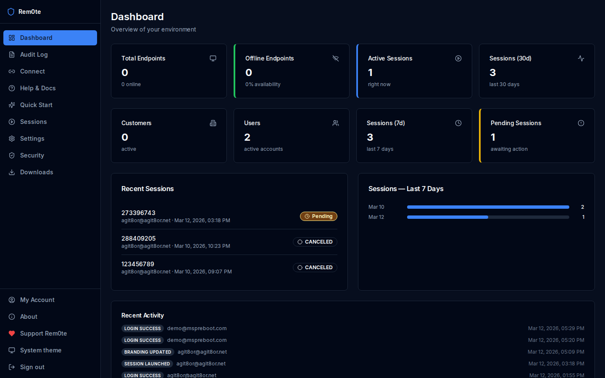
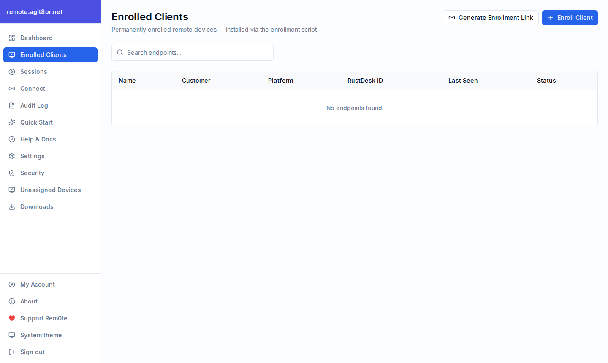
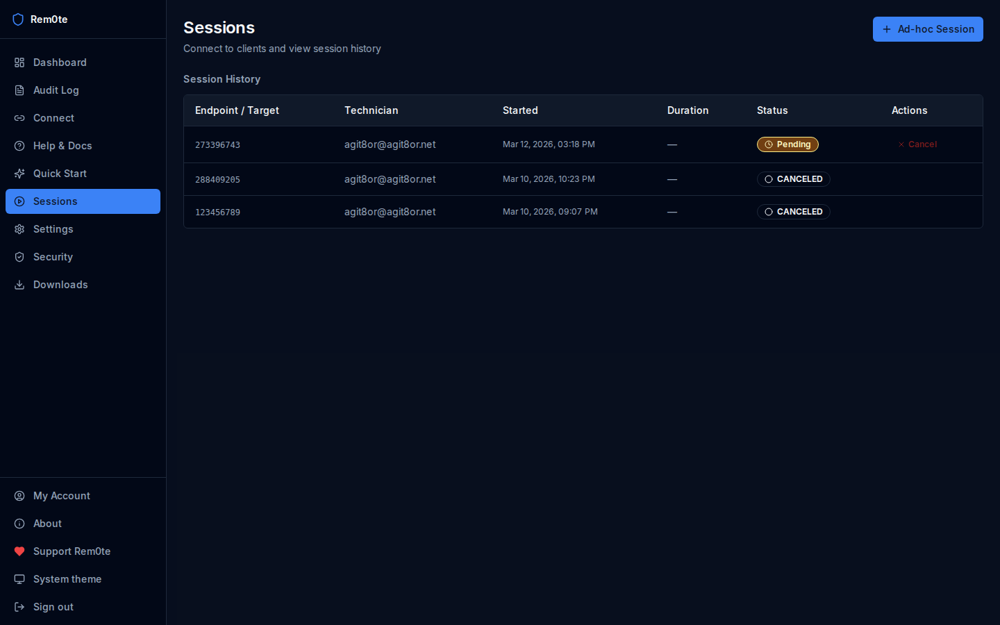
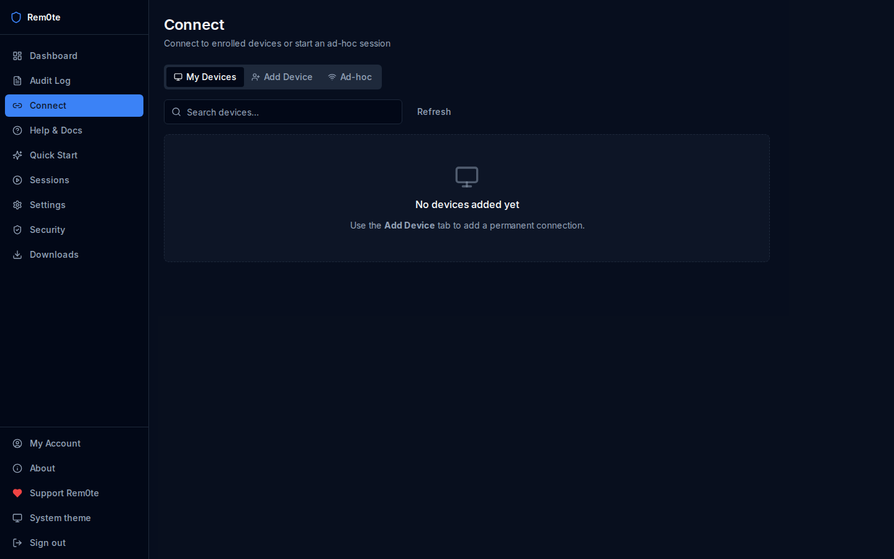
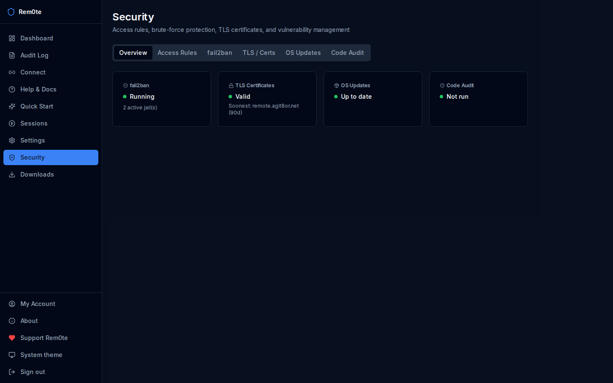
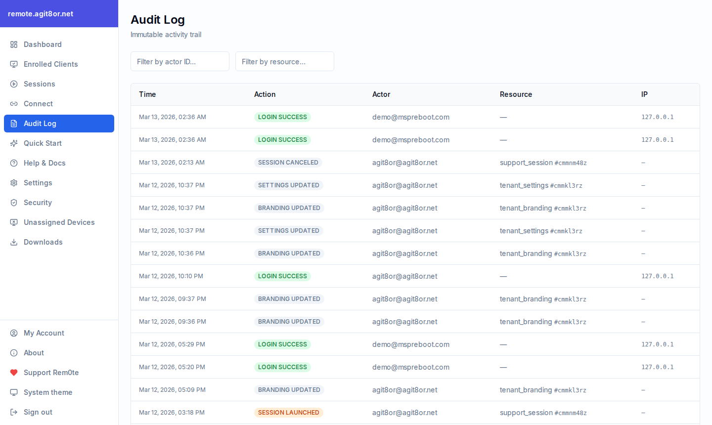
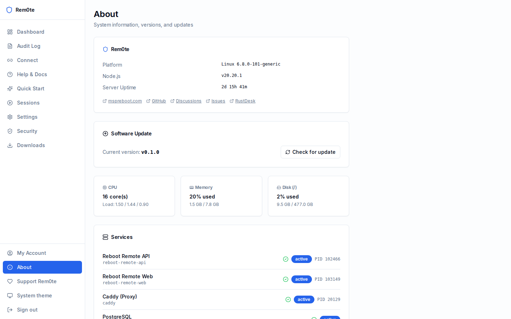

# Rem0te 🐾

> Secure self-hosted remote access for businesses.
> Users sign in and connect to the company computers they've been granted access to. That's it.
> Managed by **Luna** — a very good German Shepherd Dog.

⭐ If Rem0te is useful to you, a star helps others find it!

[](https://github.com/agit8or1/rem0te/stargazers)
[](https://github.com/agit8or1/rem0te/releases)
[](https://github.com/agit8or1/rem0te/issues)
[](LICENSE)

---

## What Rem0te is (and isn't)

**Rem0te is:** a business remote-access product. One Rem0te operator hosts the platform; many companies buy access; each company's administrators create users and register computers, and each user only sees the computers they've been assigned to.

**Rem0te is not:** an RMM. No patch management, no software inventory, no ticketing, no monitoring dashboards. RustDesk is the underlying remote-desktop transport — an implementation detail hidden from the customer experience.

```
                 REM0TE PLATFORM
                       |
        +--------------+---------------+
        |                              |
   ACME Manufacturing            Smith Accounting
        |                              |
      Users                          Users
        ↕                              ↕
    Computers                      Computers
```

---

## Who does what

### Employee
1. Log in.
2. Land on **My Computers** — the list of PCs an admin has authorized you for.
3. Click **Connect**. Rem0te fetches the credentials and launches RustDesk with the password pre-filled.

No RustDesk ID typing, no password copy-paste, no server configuration.

### Company Admin
- **Users** — invite, disable, remove company users.
- **Computers** — see every company computer, its assigned users, status.
- **Add Computer** — pick company + who can access it + Windows/Linux/macOS. Copy the one-line install command. That's it.
- **Access** — grant / revoke user → computer authorization at any time.
- **Security** — MFA, GeoIP (planned), session policy.
- **Audit** — who accessed what, when, from where.

### Platform Admin
- **Companies** — add / disable / manage every customer business.
- **Global Computers** — search / audit computers across all companies.
- **Platform Security** — global MFA / GeoIP policy that companies inherit and can only make stricter.
- **System** — health, updates, backups.

---

## How managed enrollment works

```
Admin → Add Computer → pick company + users → Generate Installer
                                                     ↓
                        one-time PowerShell / bash command
                                                     ↓
                                            Run once on target PC
                                                     ↓
             Downloads + installs RustDesk (config baked in via MSP renamed-installer)
                                                     ↓
                    Registers with Rem0te using a customer-bound token
                                                     ↓
              Server stamps company + user access from the token — endpoint has no say
                                                     ↓
                Computer appears in the correct company; assigned users see it
                                                     ↓
                                        Employee clicks CONNECT
```

The endpoint that redeems the enrollment token **cannot** influence which company it lands in or who gets access — those are stamped from the token at mint time and validated server-side.

## How Connect works

`POST /api/v1/endpoints/:id/connect` authorizes the caller via `ComputerAccess` (or `COMPANY_WIDE` + membership) and returns `{rustdeskId, password}`. The browser copies the password to the clipboard and launches `rustdesk://connection/new/<id>?password=<url-encoded>`. Modern RustDesk builds honor the URI password (truly one click); older builds fall back to the clipboard paste. Every reveal is audited.

---

## Security posture

| Threat | Control |
|---|---|
| Cross-company data access | `tenantId` filter on every Prisma query; `ComputerAccess` many-to-many; enrollment token binds company + users at mint time |
| Endpoint password exposure | Ciphertext never leaves the server. Plaintext only via authorized `getPassword` / `connect` — throttled, MFA-gated, audited (`ENDPOINT_PASSWORD_REVEALED`) |
| Enrollment token abuse | 256-bit random, SHA-256 hashed at rest, one-time, TTL-bound, atomic redemption |
| Stale JWT after role change | JWT re-checks `user.isPlatformAdmin`, `tenant.isActive`, `membership.isActive` on every request |
| Recovery-code brute force | 5/min throttle + per-user 5-fail → 15-min lockout, audited |
| Auth cookies | HttpOnly, SameSite=strict, Secure=true whenever `NODE_ENV=production` |
| Trusted-proxy spoofing | `TRUSTED_PROXIES` env drives Express `trust proxy` (default `loopback`) |
| Installer supply chain | Windows installer uses RustDesk MSP renamed-installer + `--config` — verifies effective config against public `rustdesk.com` and hard-fails (exit 20) if a public rendezvous survives |
| In-app updater | Off by default. Requires `ALLOW_IN_APP_UPDATE=true` and signed GPG tag (`git tag --verify`) |
| Sudoers | No wildcards. Only the exact commands the API executes are allowed, `visudo -c` validated |

Full audit trail: [`docs/SECURITY-AUDIT.md`](docs/SECURITY-AUDIT.md).

---

## Stack

| Layer | Tech |
|-------|------|
| API | NestJS + Prisma + PostgreSQL + Redis |
| Web | Next.js 14 App Router + shadcn/ui + TanStack Query |
| Desktop launcher | Tauri 2.0 (optional) |
| Remote transport | RustDesk hbbs / hbbr, self-hosted |
| Deploy | systemd on Ubuntu (no Docker required) |

---

## Screenshots

*Screenshots below are from Rem0te v0.3.x; regeneration on the v0.5.x UI is deferred until an automated Playwright pipeline is set up.*

| Dashboard | Enrolled Clients |
|-----------|-----------------|
|  |  |

| Sessions | Connect |
|----------|---------|
|  |  |

| Security | Audit Log |
|----------|-----------|
|  |  |

| About & Updates |
|-----------------|
|  |

---

## Quick start (self-hosting)

See [docs/setup.md](docs/setup.md) for full installation instructions.

```bash
git clone https://github.com/agit8or1/rem0te
cd rem0te
pnpm install

cp apps/api/.env.example apps/api/.env
# Edit .env — DATABASE_URL, JWT_SECRET, ENCRYPTION_KEY (openssl rand -hex 32), etc.

pnpm build
sudo systemctl start reboot-remote-api reboot-remote-web
```

Prerequisites: PostgreSQL 14+, Redis, RustDesk `hbbs` + `hbbr` on the same host, Caddy for TLS.

---

## Contributing

Issues, ideas, and pull requests are welcome.

- 🐛 [Report a bug](https://github.com/agit8or1/rem0te/issues/new?template=bug_report.md)
- 💡 [Request a feature](https://github.com/agit8or1/rem0te/issues/new?template=feature_request.md)
- 💬 [Join the discussion](https://github.com/agit8or1/rem0te/discussions)

---

## Project Manager

This project is overseen by **Luna**, a German Shepherd Dog of exceptional intelligence and discerning taste in remote support software. All major decisions are reviewed by Luna before merging.

🐾

---

## Support this project

- ⭐ [Star on GitHub](https://github.com/agit8or1/rem0te)
- 💖 [GitHub Sponsors](https://github.com/sponsors/agit8or1)

---

## License

MIT — see [LICENSE](LICENSE)
