<div align="center">

# Rem0te

**Self-hosted remote support for customer businesses, powered by RustDesk.**

One operator, many customer businesses — each with its own computers, its own
people and its own history. Rem0te is the portal around a self-hosted RustDesk
server that keeps them organised and separate.

[](https://github.com/agit8or1/rem0te/actions/workflows/ci.yml)
[](https://github.com/agit8or1/rem0te/releases)
[](LICENSE)
[](https://github.com/agit8or1/rem0te)

[Quick start](#quick-start) · [Screenshots](docs/screenshots.md) · [Walkthrough](#watch-the-walkthrough) · [Documentation](docs/README.md) · [Security](#security) · [MSPReboot](https://mspreboot.com)

</div>

---

<a href="docs/images/github/dashboard-light.png">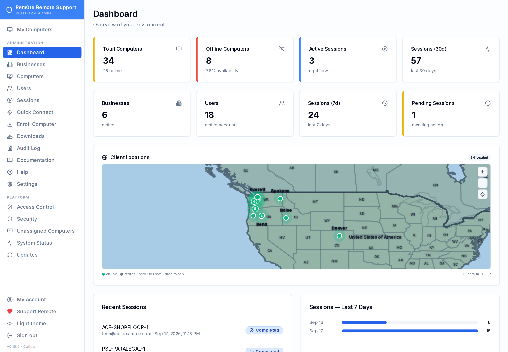</a>

<sub><i>The operator's view — every customer business, computer and session in one place. <a href="docs/images/github/dashboard-light.png">Full size</a> · <a href="docs/screenshots.md">34 more screenshots</a></i></sub>

---

## What's new in 0.18

**Every computer describes itself.** Hardware, storage, network adapters, who
is signed in, uptime, and how many Windows updates it is waiting on — collected
by the managed agent on its heartbeat, with live CPU, memory and disk gauges
that say how old their sample is. [inventory.md](docs/inventory.md)

**Read a Windows event log without connecting.** Pick a log, a window and the
levels; the request is collected on the computer's next heartbeat. Five logs,
allowlisted twice, behind its own permission — somebody else's Security log is
not the same as a name and an online dot.

**Works from Tactical RMM.** Right-click an agent in TRMM and connect through
Rem0te, or open that computer's page. Hostnames collide between customers, so
Rem0te asks rather than guessing — and remembers your answer.
[tactical-rmm.md](docs/tactical-rmm.md)

**Upgrade the agent from the console.** *Reinstall agent* re-runs the installer
on the next heartbeat, keeping the machine's configuration, password and
enrolment. It is also the only way to reach a machine whose RustDesk client is
already current.

**A dashboard that fits one screen**, with host CPU, memory, disk and live
bandwidth for the operator, and a count of sessions actually relaying through
the server.

Full detail in the [changelog](CHANGELOG.md).

---

## Why it helps

**Every customer's computers in one place.** No spreadsheet of RustDesk IDs, no
"which machine was that again?". Computers are grouped by the business that owns
them, with platform, online state and last-seen time.

**Connect without passing passwords around.** A technician clicks **Connect**;
Rem0te authorises the request and hands the credentials to the RustDesk client on
their own PC. Nothing is typed, emailed or kept in a shared note — and every
reveal is written to the audit log.

**Give each person exactly the access they need.** A Business Owner decides who
may see which computers and what they may do, without the operator being in the
loop for every change.

**Diagnose before you interrupt anyone.** Each computer reports its own
hardware, disk space, signed-in user, uptime and pending Windows updates, and
you can pull a slice of its Windows event log without starting a session. Half
of "can you take a look at my PC?" is answerable without touching the machine
— and reading event logs is a separate permission from seeing the computer,
because someone else's Security log is not the same as a name and an online
dot.

---

## See it in action

<table>
<tr>
<td width="50%"><a href="docs/images/github/client-map-dark.png">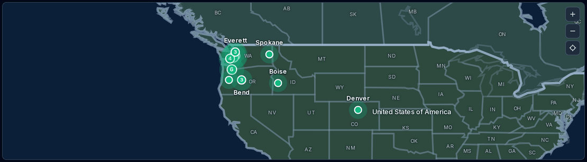</a><br><sub><b>Know where the estate is.</b> Managed computers plotted from their last check-in, clustered by city. <i>Dark</i></sub></td>
<td width="50%"><a href="docs/images/github/business-computers-dark.png">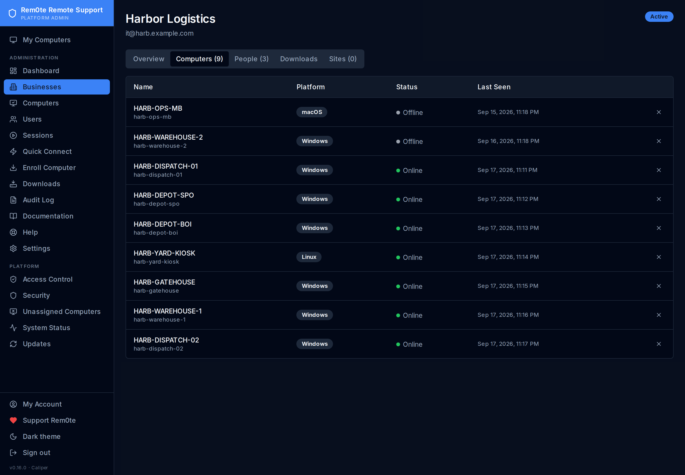</a><br><sub><b>Answer "my PC is broken" fast.</b> One customer's machines, with live status. <i>Dark</i></sub></td>
</tr>
<tr>
<td width="50%"><a href="docs/images/github/device-specs-dark.png">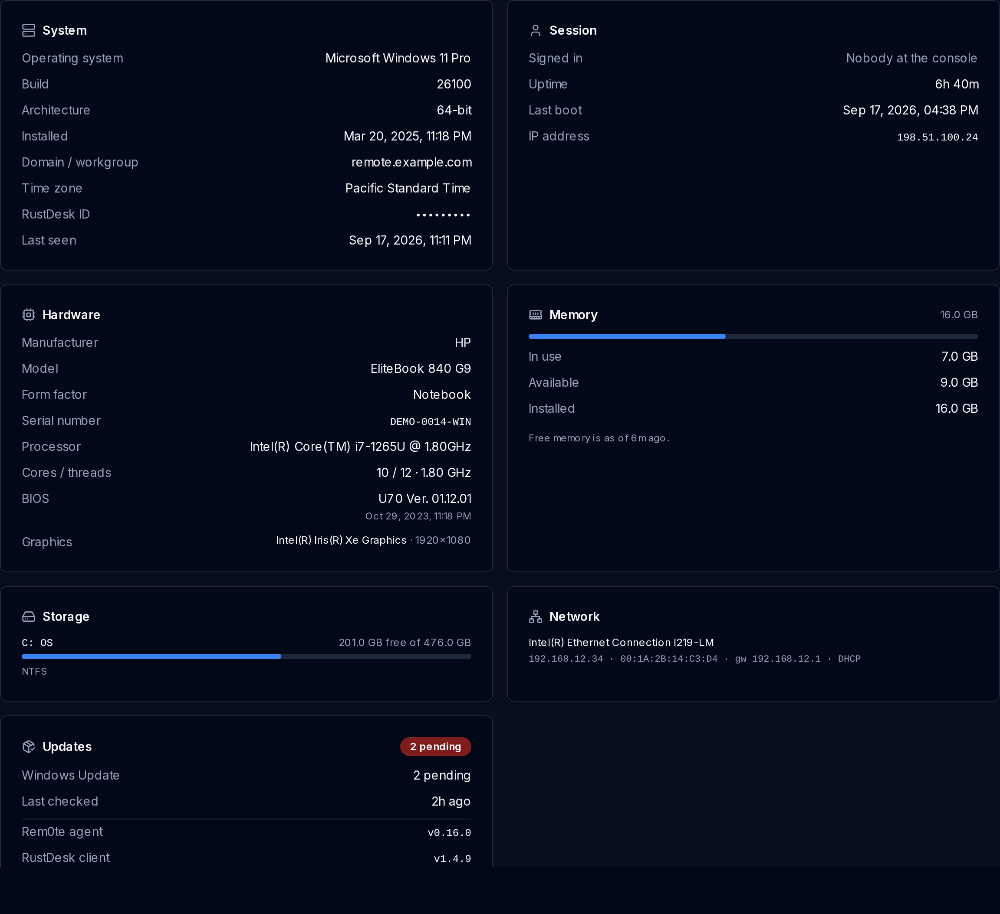</a><br><sub><b>Know the machine before you touch it.</b> Hardware, disk space, who is signed in, how long it has been up, and what it is waiting to install. <i>Dark</i></sub></td>
<td width="50%"><a href="docs/images/github/device-event-log-dark.png">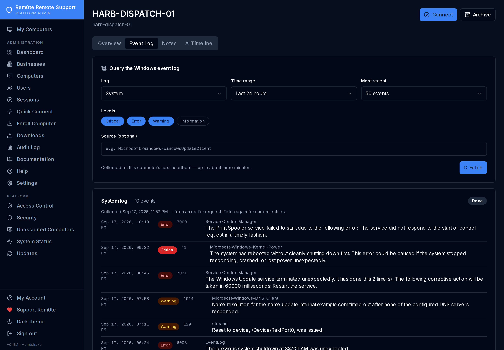</a><br><sub><b>Read the event log without connecting.</b> Five Windows logs, filtered by level and window — and reading them is its own permission. <i>Dark</i></sub></td>
</tr>
<tr>
<td width="50%"><a href="docs/images/github/enroll-device-light.png">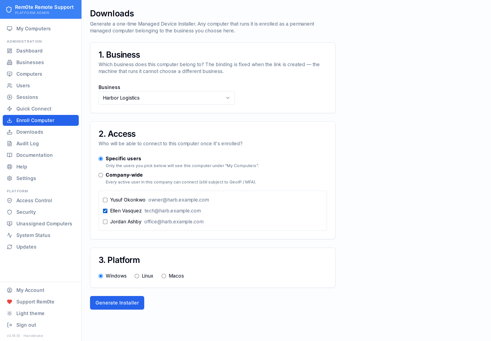</a><br><sub><b>Onboard a machine in one run.</b> The business is fixed into the installer; the machine cannot pick another. <i>Light</i></sub></td>
<td width="50%"><a href="docs/images/github/access-users-dark.png">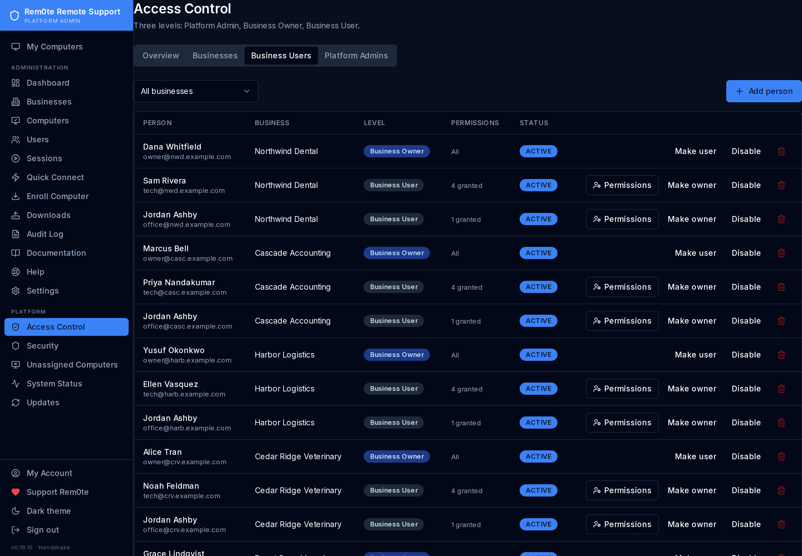</a><br><sub><b>Delegate safely.</b> Each user shows the capabilities actually granted, not a role name. <i>Dark</i></sub></td>
</tr>
<tr>
<td width="50%"><a href="docs/images/github/trmm-match-dark.png">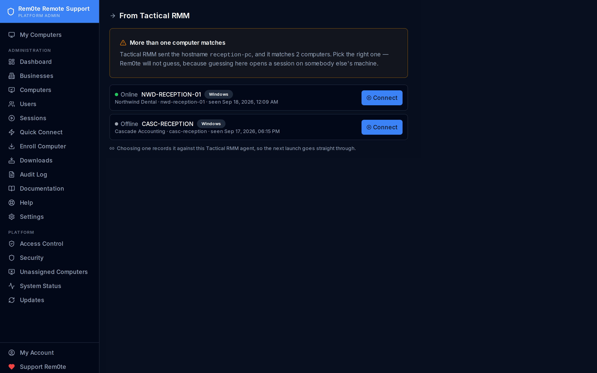</a><br><sub><b>Launch from Tactical RMM.</b> Right-click an agent in TRMM and connect through Rem0te. Two customers with the same hostname? It asks, then remembers. <i>Dark</i></sub></td>
<td width="50%"><a href="docs/images/github/device-resources-light.png">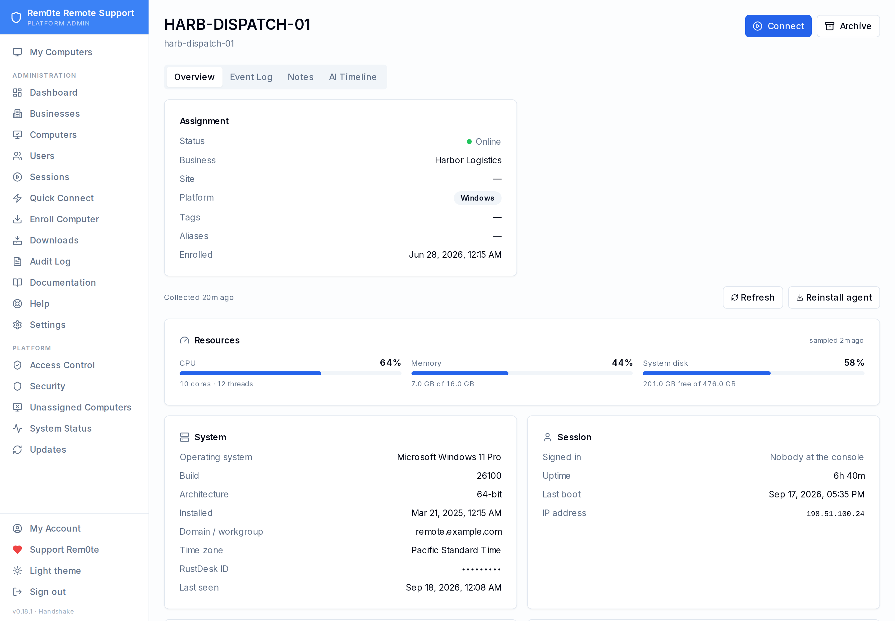</a><br><sub><b>See the state before you connect.</b> CPU, memory and disk sampled on the heartbeat — and the card says how old the reading is. <i>Light</i></sub></td>
</tr>
<tr>
<td width="50%"><a href="docs/images/github/quick-connect-light.png">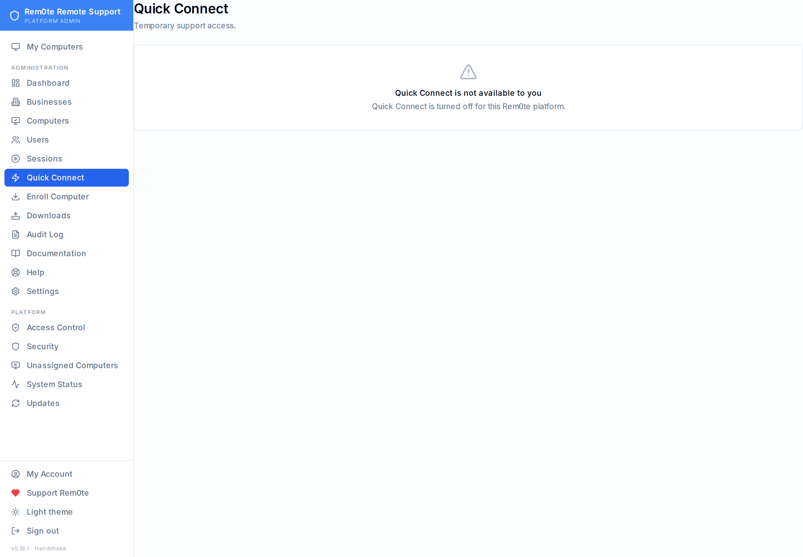</a><br><sub><b>Help a machine you don't manage.</b> No install, no enrolment — it ends when they close the client. <i>Light</i></sub></td>
<td width="50%"><a href="docs/images/github/audit-timeline-dark.png">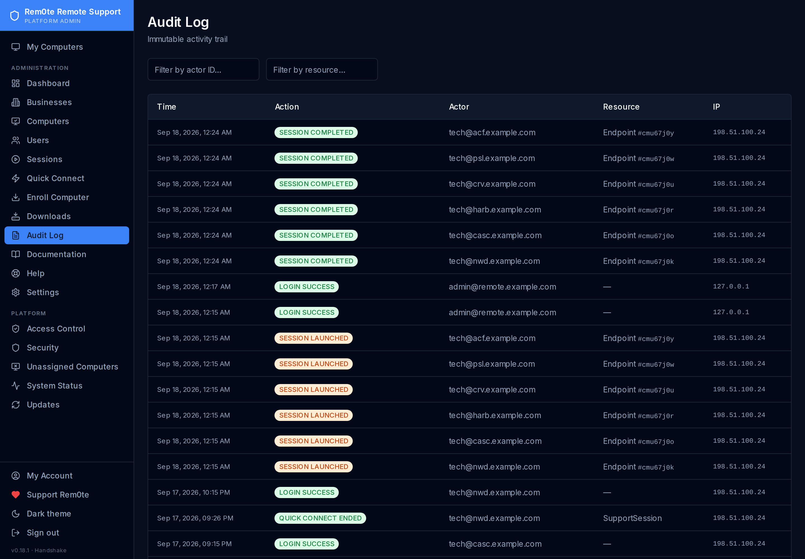</a><br><sub><b>Prove what happened.</b> An append-only trail of sign-ins, sessions and credential reveals. <i>Dark</i></sub></td>
</tr>
</table>

**[→ See all 35 screenshots](docs/screenshots.md)** — dashboards, monitoring,
inventory, workflows, administration and configuration, in light and dark.

---

## Watch the walkthrough

A recorded tour of the real application — the dashboard, three end-to-end
workflows, then Quick Connect, session history and the audit log, in both themes.

> Recorded at **v0.13.5**. Everything in it still works the same way, but the
> dashboard has since been rebuilt to fit one screen and the device page has
> gained inventory, resource gauges and an event-log tab — so the
> [screenshots](docs/screenshots.md) are the current picture of those two.

<a href="https://github.com/agit8or1/rem0te/releases/download/v0.13.5/walkthrough.mp4"></a>

**[▶ Watch the walkthrough](https://github.com/agit8or1/rem0te/releases/download/v0.13.5/walkthrough.mp4)** (2 min 28 s)
 · [52-second highlight](https://github.com/agit8or1/rem0te/releases/download/v0.13.5/highlight.mp4)
 · [transcript](docs/media/walkthrough-script.md)
 · [captions](docs/media/walkthrough.vtt)

> Everything shown is an isolated demo environment — fictitious businesses,
> synthetic devices, and no remote session at any point. The walkthrough is
> **caption-led: there is no narration and no audio track.** The transcript
> carries a narration-ready script if you want to add one.

---

## How the pieces fit

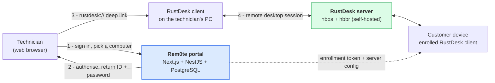
```mermaid
flowchart LR
  Tech["Technician<br/>(web browser)"]
  Portal["<b>Rem0te portal</b><br/>Next.js + NestJS + PostgreSQL"]
  Local["RustDesk client<br/>on the technician's PC"]
  RD["<b>RustDesk server</b><br/>hbbs + hbbr (self-hosted)"]
  Dev["Customer device<br/>enrolled RustDesk client"]

  Tech -->|"1 - sign in, pick a computer"| Portal
  Portal -->|"2 - authorise, return ID + password"| Tech
  Tech -->|"3 - rustdesk:// deep link"| Local
  Local <-->|"4 - remote desktop session"| RD
  RD <--> Dev
  Portal -.->|"enrollment token + server config"| Dev

  style Portal fill:#dbeafe,stroke:#2563eb
  style RD fill:#dcfce7,stroke:#16a34a
```

**Rem0te adds** the portal: businesses, accounts and permissions, managed device
enrollment, credential storage and release, session records and the audit log.
**RustDesk provides** the remote desktop itself — the `hbbs` rendezvous server,
the `hbbr` relay, and the clients. Rem0te never sees the pixels or the keystrokes.

**Browser launching, not browser-based control.** Clicking **Connect** opens a
`rustdesk://` deep link, which the OS hands to the RustDesk client already
installed on the technician's machine. **A local RustDesk client is required.**
There is no in-browser remote desktop.

### Managed devices vs Quick Connect

|  | **Managed device** | **Quick Connect** |
|---|---|---|
| Set up by | Running a one-time enrollment installer | The person being helped runs a client |
| Lives in | The business's computer list, permanently | Nowhere — no computer record is created |
| Connect using | Stored credentials, released on authorisation | An ID and password they read out |
| Ends when | You remove it | They close the client |

---

## Who does what

Three levels, and no reseller hierarchy.

| Level | Scope |
|---|---|
| **Platform Admin** | The operator. Runs the service, creates and manages every customer business, owns platform settings. |
| **Business Owner** | Full control of **one** business — its computers, people, sessions and history. Nothing outside it. |
| **Business User** | Exactly the capabilities their Business Owner granted, over the computers they were given. |

A **Business** is the boundary that matters, and it is enforced on the server
rather than by hiding buttons. Full model in [docs/access-control.md](docs/access-control.md).

---

## Does this need RustDesk Pro?

**No.** Rem0te runs against the open-source RustDesk server and the standard
open-source clients. The installer fetches `hbbs`/`hbbr` from the OSS
[`rustdesk/rustdesk-server`](https://github.com/rustdesk/rustdesk-server)
releases, and every client configuration Rem0te generates sets `api-server = ''`
— RustDesk's own API server, a Pro component, is deliberately unused. Rem0te's
portal fills that role.

No paid component, licence key or subscription is required by this project.
Rem0te is MIT-licensed. RustDesk is a separate project under its own licence.

---

## Quick start

Full instructions, including manual installation, in [docs/setup.md](docs/setup.md).

```bash
git clone https://github.com/agit8or1/rem0te
cd rem0te
sudo bash deploy/scripts/install.sh your-domain.example.com admin@example.com
```

The installer sets up Node.js, PostgreSQL, Redis, Caddy (automatic HTTPS),
fail2ban, the RustDesk server and its keypair, builds the app, runs migrations,
seeds a Platform Admin and starts the systemd services. It prints the login URL
and admin credentials at the end — **save them immediately**.

### Enrolling a customer's computer

1. **Businesses → Add Business** — create the customer.
2. **Enroll Computer** — choose the business, who may connect, and the platform.
   The business is bound into the token here and the machine cannot change it.
3. **Generate Installer** — a one-time command or a Windows installer executable.
4. Run it once on the target machine, as administrator.
5. The computer appears in that business's list; the users you selected see it
   under **My Computers**.

---

## Requirements and limitations

**Server** — Ubuntu 22.04 LTS or Debian 12, 1 GB RAM minimum (2 GB recommended),
10 GB disk, a public IP. A domain is strongly recommended; automatic HTTPS
depends on it. Node.js 20+, PostgreSQL, Redis and Caddy are installed for you.
Deployment is plain systemd — Docker is not required.

**Ports** — 80 and 443 for the portal, plus RustDesk's own: 21115 (TCP),
21116 (TCP **and** UDP), 21117 (TCP), 21118–21119 (TCP websocket, optional).

**Endpoints** — enrollment scripts are generated for **Windows**, **Linux** and
**macOS**. Windows additionally has a compiled installer executable.

**RustDesk** — `hbbs`/`hbbr` are installed from the latest OSS release. Generated
client configuration targets the RustDesk **1.4.x** client series.

### Limitations

- **Not an RMM.** No patch management, software inventory, ticketing or monitoring.
- **No in-browser remote control** — a local RustDesk client is required.
- **One RustDesk server per instance.** Relay host and public key are
  platform-wide settings, not per-business.
- **No trend or time-series charting.** The dashboard has stat tiles, a
  seven-day session bar chart and a client map; there is no charting library and
  no historical graphing beyond that.
- Automatic HTTPS requires a domain; a bare IP works but over plain HTTP.

---

## Security

- **Report a vulnerability:** follow [SECURITY.md](.github/SECURITY.md) and do
  **not** open a public issue. Private reporting is enabled on this repository.
- **What is enforced:** [docs/SECURITY-AUDIT.md](docs/SECURITY-AUDIT.md) records
  the review passes. This is an **internal review by the project, not an
  independent third-party audit**.
- Business isolation is covered by an automated suite
  (`apps/api/scripts/e2e-business-access.mjs`) and static invariant checks
  (`scripts/check-security-invariants.mjs`), both run by CI on every push.

## Updating

Rem0te, the RustDesk clients on endpoints, and `hbbs`/`hbbr` update
independently — [docs/updates.md](docs/updates.md) explains which is which. The
in-app updater is **off by default** and requires a GPG-signed release tag.

## Documentation

**[Start at the docs index](docs/README.md)** — it routes by what you are doing.

| Guide | For |
| --- | --- |
| [Screenshots](docs/screenshots.md) | The full gallery — every screen, light and dark. |
| [Troubleshooting](docs/troubleshooting.md) | Something will not connect. Start here. |
| [Technician Guide](docs/technician-guide.md) | Day-to-day use — connecting, Quick Connect, enrolling. |
| [Connecting](docs/connecting.md) | What happens when you click Connect. |
| [Clients](docs/clients.md) | Every RustDesk client Rem0te hands out. |
| [Inventory & event logs](docs/inventory.md) | What a computer reports about itself, and reading its Windows event log. |
| [Tactical RMM](docs/tactical-rmm.md) | Connecting and querying from inside Tactical RMM. |
| [Setup](docs/setup.md) | Installing and operating a server. |
| [Architecture](docs/architecture.md) | What runs where, and the RustDesk config chain. |
| [Access Control](docs/access-control.md) | The three-level model and capabilities. |
| [API Reference](docs/API-REFERENCE.md) | Every route and its required capability. |
| [Public API](docs/PUBLIC-API.md) | Scripted RMM/PSA integration, scopes and examples. |

## Contributing

Issues, ideas and pull requests are welcome.

- [Report a bug](https://github.com/agit8or1/rem0te/issues/new?template=bug_report.md)
- [Request a feature](https://github.com/agit8or1/rem0te/issues/new?template=feature_request.md)
- [Discussions](https://github.com/agit8or1/rem0te/discussions)

Every change bumps the version and adds a changelog entry — see [CLAUDE.md](CLAUDE.md).

---

## More tools from MSPReboot

Rem0te is published by **[MSPReboot](https://mspreboot.com)**, an MSP consulting
practice that also releases free, self-hostable tools for MSPs. The other
open-source projects listed there:

| Project | What it is |
|---|---|
| [ClientSt0r](https://github.com/agit8or1/clientst0r) | Customer documentation, assets and knowledge base |
| [OPNMGR](https://github.com/agit8or1/OpnMgr) | OPNsense firewall fleet management |
| [Depl0y](https://github.com/agit8or1/Depl0y) | Proxmox infrastructure and VM deployment |
| [St0r](https://github.com/agit8or1/St0r) | UrBackup backup visibility and administration |

These are separate projects with their own repositories and licences.

**Rem0te is MIT-licensed and free to self-host** — the install guide above is
all you need, and nothing here requires an engagement. If you would rather not
run it yourself, **MSPReboot offers hosting and support for Rem0te**:
[get in touch](https://mspreboot.com/contact).

## License

MIT — see [LICENSE](LICENSE).

---

<sub>Project managed by **Luna**, a German Shepherd Dog with discerning taste in remote support software. 🐾</sub>
