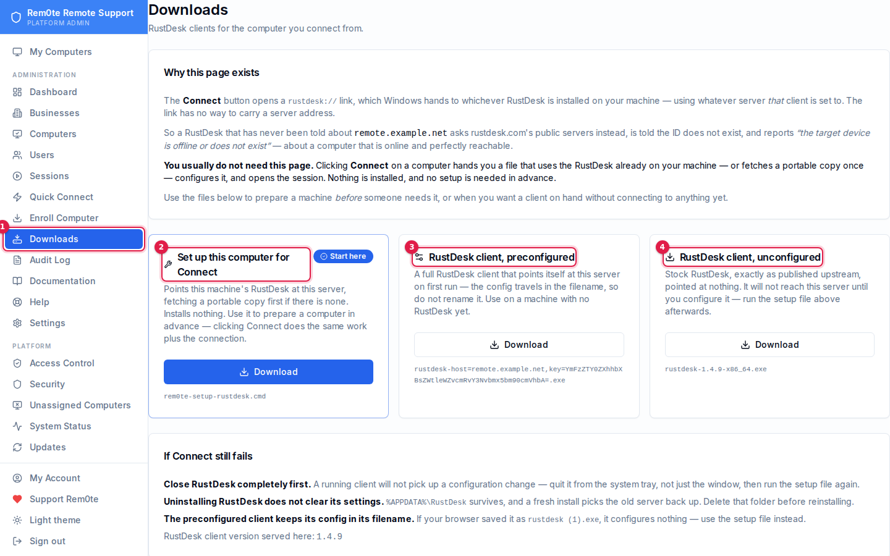

# Clients

Every RustDesk client Rem0te hands out, who it is for, and how it learns where
this server is.

There is exactly one thing a RustDesk client needs from you: **the ID/relay host
and the server's public key.** Everything on this page is a different way of
delivering those two values.

---

## Which one do I want?

| You are… | Use | Where |
|---|---|---|
| Connecting to a computer, from anything | **Just click Connect** | Rem0te → Computers |
| Setting a machine up ahead of time | **Set up this computer for Connect** | Rem0te → Downloads |
| A technician on a machine with no RustDesk | **Preconfigured client** | Rem0te → Downloads |
| Deploying to a computer to be supported | **Managed installer** | Rem0te → Enroll Computer |
| Helping someone with no account and no install | **Quick Connect** | Send them `/quick` |
| Wanting stock RustDesk, unmodified | **Unconfigured client** | Rem0te → Downloads |

---

## Connect — the zero-setup path

**Connect** on a computer's page hands you a single file, named for the machine
you are connecting to. Run it and it:

1. Uses the RustDesk already on the computer — or, if there is none,
   fetches a portable copy once into `%LOCALAPPDATA%\Rem0te` and reuses it
   every time after
2. Points it at this server
3. Opens the session, with the password already applied

**Nothing is installed**, so there is no UAC prompt and no elevation. Only the
first run on a machine without RustDesk pays the ~24 MB download; every connect
after that starts immediately.

It assumes nothing about the machine it runs on, which is the point: it works on
a technician's laptop that has never seen Rem0te before, and on one whose
RustDesk auto-updated to a stock build this morning.

It carries a live credential and **deletes itself when it finishes**. Do not
keep or forward it; click Connect again if you need another.

Once a machine has been through this once, its RustDesk is configured and the
Connect button's `rustdesk://` link would work directly too.

---

## Technician clients — Rem0te → Downloads



1. **Downloads** in the sidebar. Separate from *Enroll Computer*, which prepares
   the machine being supported rather than the one supporting it.
2. **Set up this computer for Connect** — the one to reach for. Points this
   machine's RustDesk at the server, fetching a portable copy first if there is
   none.
3. **Preconfigured client** — a full client that configures itself from its own
   filename. For a machine with no RustDesk at all.
4. **Unconfigured client** — stock RustDesk, pointed at nothing.


These are for the computer you connect **from**. They are authenticated; only
signed-in users can fetch them.

### Set up this computer for Connect *(start here)*

`rem0te-setup-rustdesk.cmd` — finds the RustDesk already on the machine, or
fetches a portable copy into `%LOCALAPPDATA%\Rem0te`, and points it at this
server with `rustdesk --config <base64>`. It installs nothing and touches
nothing else.

Use it to prepare a machine ahead of time. Clicking **Connect** does the same
work plus the connection, so this is for the case where you want the setup done
before someone needs it.

A `.cmd` and not a `.ps1` on purpose: PowerShell scripts do not run on
double-click under the default execution policy, and someone whose remote
support just broke should not also have to learn about `Set-ExecutionPolicy`.

**Quit RustDesk completely before running it** — tray icon, not just the
window. A running client will not pick up the change.

### Preconfigured client

The stock RustDesk executable, renamed:

```
rustdesk-host=remote.example.net,key=<base64>.exe
```

RustDesk parses its own filename on first run and configures itself from it.
Use it on a machine with no RustDesk at all.

**Do not rename it.** The filename *is* the configuration. If your browser
saves it as `rustdesk (1).exe` it configures nothing — use the setup `.cmd`
instead, which cannot be defeated this way.

### Unconfigured client

Stock RustDesk exactly as published upstream, pointed at nothing. It will not
reach this server until you configure it. Provided for the cases where you want
a known-clean binary — comparing behaviour, or configuring by hand afterwards.

---

## Managed installer — Rem0te → Enroll Computer

For a computer that will be supported on an ongoing basis. This is the only
client that does more than configure RustDesk:

- Installs RustDesk as a service and applies this server's config
- Sets a permanent password and reports it to Rem0te, encrypted
- Installs a scheduled task that heartbeats every ~3 minutes, which is what
  drives the online dot, the credential-rotation channel, and the RustDesk
  client update channel
- Claims the machine into a business if given an enrolment token

It is **idempotent** — safe to re-run, and re-running is the supported way to
repair a broken install or apply a staged upgrade.

> **Installs from before v0.8.2 need to be re-run.** They wrote the RustDesk
> service config to a path the service never reads, so the service ran on
> defaults pointing at the public `rustdesk.com` rendezvous while every check
> passed. Those machines were reachable by strangers on public infrastructure.
> Re-running the installer is the fix; rotate any credential that predates it.

---

## Quick Connect — the unattended customer

Public, no account, nothing installed. Send them to:

```
https://<your-host>/quick
```

They download and run a client whose configuration travels in its filename,
then read you the 9-digit ID it shows. You connect from **Rem0te → Quick
Connect**.

Nothing on that page exposes the console, business names, user identities, or
any enrolled computer. It answers two questions: is Quick Connect on, and give
me the client.

Platform Admins turn it on per-platform and per-OS under **Settings**. Windows
gets the real binary; macOS and Linux get a launcher script, because the
config-in-filename trick is specific to the Windows executable and repackaging
a signed `.app` would break its signature.

---

## Configuring a client by hand

All the automated paths above end in the same place, and you can do it directly:

```bat
rustdesk.exe --config <base64>
```

where the base64 decodes to:

```
host=<your-host>,key=<public-key>,api=,relay=<your-host>
```

Generate it:

```bash
HOST=remote.example.net
KEY=$(cat /var/lib/rustdesk-server/id_ed25519.pub)
printf 'host=%s,key=%s,api=,relay=%s' "$HOST" "$KEY" "$HOST" | base64 -w0
```

Or set it in the UI: RustDesk → **Settings → Network → ID/Relay Server**.
ID Server and Relay Server both take the host; Key takes the public key.

### Where the values live

| Value | Source of truth |
|---|---|
| Host | Rem0te **Settings → RustDesk → Relay Host** |
| Public key | `/var/lib/rustdesk-server/id_ed25519.pub` |

**These must match.** Rem0te's stored key is what every generated installer and
download embeds; hbbs and hbbr are started with `-k _`, which reads
`id_ed25519.pub` and rejects any client presenting a different key with
`LICENSE_MISMATCH`. Regenerating the server keypair invalidates every client
configured before that moment.

---

## Client versions

The client version served by every download is the latest RustDesk release,
resolved from GitHub once an hour and cached on disk so a support call does not
depend on GitHub being reachable at that moment.

Endpoints report their installed version on each heartbeat, and
**Updates → RustDesk Clients** shows current versus latest per machine and
stages upgrades. Only installers from v0.8.2 onward report a version; older
ones show as *Unknown* rather than *Outdated*, and will not apply a staged
upgrade — re-run the installer on those. See [updates.md](updates.md).

---

## See also

- [connecting.md](connecting.md) — what happens after you click Connect
- [updates.md](updates.md) — keeping clients and the server current
- [troubleshooting.md](troubleshooting.md)
