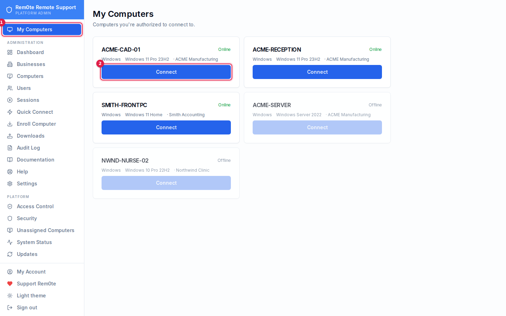

# Connecting

How a click in Rem0te becomes a remote desktop session, what each path needs to
be true, and why the most common failure blames the wrong computer.

If you are here because of *"Failed to connect: the target device is offline or
does not exist"*, skip to [When it fails](#when-it-fails) — but read
[The thing that surprises everyone](#the-thing-that-surprises-everyone) first,
because that message is usually about the computer you are sitting at.

---

## The pieces

Rem0te does not carry remote-desktop traffic. RustDesk does. Rem0te decides
*who may connect to what*, hands out the credential, and gets out of the way.

| Piece | What it does |
|---|---|
| **Rem0te API / web** | Access control, credentials, audit. Knows nothing about the live connection. |
| **hbbs** (port 21116) | RustDesk *rendezvous*. Every client registers here; every connection starts by asking it "where is peer X?" |
| **hbbr** (port 21117) | RustDesk *relay*. Carries the session when the two ends cannot reach each other directly. |
| **RustDesk client** | The actual remote desktop, on both ends. |

Two independent notions of "online" follow from this, and they are the source
of most confusion:

- **Rem0te's online dot** is an HTTP heartbeat from the endpoint every ~3
  minutes. The API marks an endpoint offline after ~10 minutes without one.
- **RustDesk's idea of online** is a live registration with hbbs. hbbs holds
  that map **in memory only**.

A Connect uses *only the second one*. They can disagree — and when they do, the
UI shows a green dot next to a machine that RustDesk will tell you is offline.
[`hbbs-probe.py`](#asking-hbbs-directly) exists to settle that argument.

---

## The connect paths

There are three, and they are not equivalent.



1. **My Computers** — the computers this account may connect to. Platform Admins
   and Business Owners get the full list under **Computers**.
2. **Connect** — downloads the script described below.

### 1. The Connect button — a downloaded script

Clicking **Connect** hands you one file, named for the target machine. It uses
the RustDesk already on the computer — or fetches a portable copy once into
`%LOCALAPPDATA%\Rem0te` — points it at this server, then opens the session
with the password applied. It deletes itself afterwards, because it carries a
live credential.

It installs nothing, so there is no elevation prompt, and only the first run on
a machine without RustDesk pays the download.

It assumes nothing about the machine it runs on. That is deliberate, and it is
what the alternative could not do:

> The obvious implementation is to open
> `rustdesk://connection/new/<id>?password=<pw>` and let Windows route it to
> the installed RustDesk. That is what Rem0te used to do, and it works **only**
> on a client that already knows this server — because **the URI scheme has no
> field for a server address.** There is no way to carry
> "use `remote.example.net`" in the link. A stock client asks `rustdesk.com`
> instead, is told the ID is unknown, and reports *"the target device is
> offline or does not exist"* about a computer that is online.

Once a machine has run the script once its RustDesk is configured, so a plain
`rustdesk://` link would work there from then on.

### 2. The desktop launcher — `reboot-remote://`

The Tauri launcher, if installed, handles `reboot-remote://launch#token=…`.
It validates a single-use 120-second token with the API, receives the target ID
*and this server's RustDesk config*, applies the config with
`rustdesk --config`, then spawns `rustdesk --connect <id>`.

Because it can apply the config, this path is self-contained — it works on a
RustDesk that has never heard of your server. It is also the only path that
does, which is why the launcher is worth installing on a shared or rebuilt
technician machine.

### 3. Quick Connect — the unattended customer

For someone with no enrolled machine and no account. They download a client
from the public `/quick` page, read you a 9-digit ID, and you connect to it.
The client configures itself: its server settings travel **in its filename**,
which RustDesk reads on first run.

---

## The thing that surprises everyone

> The Connect button uses the RustDesk on **your** computer, with **your**
> computer's server settings.

A stock RustDesk — a fresh install, or an auto-update that replaced a
preconfigured build — points at `rustdesk.com`'s public rendezvous servers.
Your endpoint IDs do not exist there. RustDesk asks, is told the ID is unknown,
and reports:

> *Failed to connect: the target device is offline or does not exist.*

The endpoint is online. The server is fine. The client you clicked from was
never told where to look.

**This is why Connect hands you a script instead of a link.** The script
configures the client before connecting, so it works the first time on a
machine that has never seen this server.

If you would rather prepare a machine in advance, **Downloads** →
*Set up this computer for Connect* does the configuration on its own. See
[clients.md](clients.md).

---

## When it fails

Work in this order. Each step rules something out for good.

### 1. Ask hbbs directly

```bash
sudo deploy/scripts/hbbs-probe.py <rustdesk-id>
```

| Verdict | Means | Do this |
|---|---|---|
| `ONLINE` | hbbs found the peer and returned a connection path. **The server and the endpoint are both fine.** | The problem is the client you are connecting *from* — go to step 2. |
| `OFFLINE` | hbbs knows the ID but has no live registration right now. | Step 3. |
| `ID_NOT_EXIST` | hbbs has never seen this ID. | Step 4. |
| `LICENSE_MISMATCH` | The key does not match the one hbbs was started with. | Step 5. |

### 2. `ONLINE`, but Connect still fails — fix the technician's client

Nothing is wrong with the endpoint. Your RustDesk is talking to someone else's
rendezvous server.

1. **Quit RustDesk completely** — from the system tray, not just the window. A
   running client will not pick up a configuration change.
2. Click **Connect** again and run the file it gives you. It reapplies the
   configuration every time, so a client that drifted gets corrected.
3. If that still fails, Rem0te → **Downloads** → *Set up this computer for
   Connect*, and watch its output — it prints which RustDesk it found.

If it still fails, confirm what the client thinks: RustDesk → **Settings →
Network → ID/Relay Server**. The ID Server must be your Rem0te host, and the
Key must match **Settings → RustDesk → Public Key** in Rem0te exactly.

Reinstalling RustDesk does *not* clear this. `%APPDATA%\RustDesk` survives an
uninstall and a fresh install picks the old server straight back up — delete
that folder before reinstalling.

### 3. `OFFLINE`

- **Within ~30 seconds of an hbbs restart, this is normal and not a fault.**
  The online-peer map is in memory; a restart empties it and clients
  re-register on their next cycle. Any `rustdesk-server` upgrade or
  `systemctl restart rustdesk-hbbs` opens that window. Wait, probe again.
- Otherwise the endpoint's RustDesk is not running, or the machine is off, or
  it has lost its route to port 21116. Check whether the Rem0te heartbeat is
  still arriving (the endpoint's **Last seen**). Heartbeat arriving but hbbs
  offline means RustDesk specifically is stopped or misconfigured on that
  machine.

### 4. `ID_NOT_EXIST`

hbbs has never seen this ID, so the endpoint is registering somewhere else —
usually `rustdesk.com`.

Re-run the Rem0te installer on the endpoint. Installs from before **v0.8.2**
wrote the RustDesk service config to a path the service never reads, leaving it
on defaults pointing at the public servers while every check passed. That fix
only lands by reinstalling.

### 5. `LICENSE_MISMATCH`

The key the client presented is not the one hbbs was started with. Compare:

```bash
cat /var/lib/rustdesk-server/id_ed25519.pub
```

against **Settings → RustDesk → Public Key** in Rem0te. They must be identical.
If you regenerated the server keypair, every installer and every client
configured before that moment is now wrong and must be reconfigured.

### 6. Connected, but the password is rejected

Rem0te stores the endpoint's permanent password encrypted and hands it to the
client in the `rustdesk://` link. It desyncs if someone ran
`rustdesk --password` on the endpoint by hand. Stage a credential rotation from
the endpoint's page, or re-run the installer.

---

## Asking hbbs directly

hbbs writes **nothing** to its log when a connection request fails — no line
for an unknown ID, none for an offline peer, none for a key mismatch. The only
way to see its answer is to ask it.

```bash
# native rendezvous, TCP 21116
sudo deploy/scripts/hbbs-probe.py 123456789

# the WebSocket path on 443, end to end through Caddy
sudo deploy/scripts/hbbs-probe.py 123456789 --ws --host remote.example.net

# check a client key rather than the server's own
deploy/scripts/hbbs-probe.py 123456789 --key '<base64 key>'
```

It sends a real `PunchHoleRequest` and decodes the reply. Exit status is 0 for
`ONLINE`, 1 for any other verdict, so it drops into a monitoring check as-is.

---

## Ports

| Port | Protocol | Used by |
|---|---|---|
| 443 | TCP | Rem0te web + API, and RustDesk over WebSocket (see below) |
| 21115 | TCP | hbbs NAT type test |
| 21116 | **TCP + UDP** | hbbs rendezvous — UDP registration, TCP connection requests |
| 21117 | TCP | hbbr relay |
| 21118 | TCP | hbbs WebSocket (`/ws/id`) |
| 21119 | TCP | hbbr WebSocket (`/ws/relay`) |

**Port 21116 needs UDP as well as TCP.** Endpoint registration is UDP; a
firewall that forwards only TCP produces endpoints that appear briefly and then
go offline.

### RustDesk over 443 only

For sites that permit nothing but 443 outbound, Caddy proxies `/ws/id` to hbbs
and `/ws/relay` to hbbr, matching `hbb_common`'s own `wss://<host>/ws/id`
convention. Clients find it without extra configuration.

This requires **rustdesk-server 1.1.16 or newer**. 1.1.15 accepts the WebSocket
upgrade and then immediately drops the connection, so the routes look present
and do nothing. Check under **Updates → RustDesk Server**, or:

```bash
hbbs --version
sudo deploy/scripts/hbbs-probe.py <id> --ws --host <your-host>
```

---

## See also

- [clients.md](clients.md) — which client to hand to whom, and how each gets configured
- [updates.md](updates.md) — keeping Rem0te, the RustDesk clients and hbbs/hbbr current
- [troubleshooting.md](troubleshooting.md) — everything else
