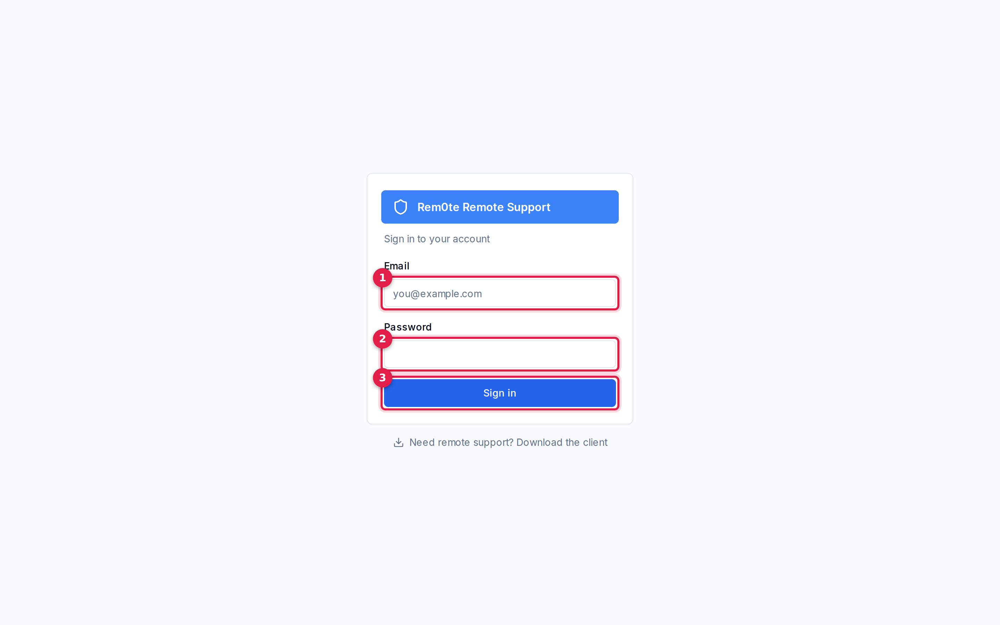
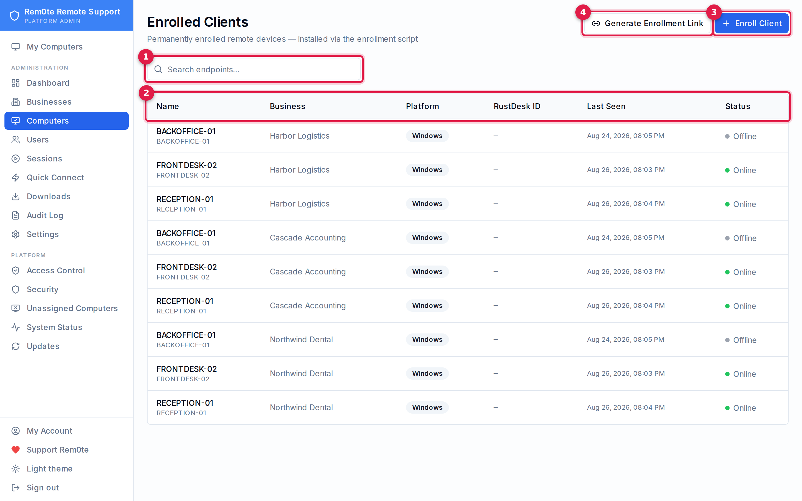
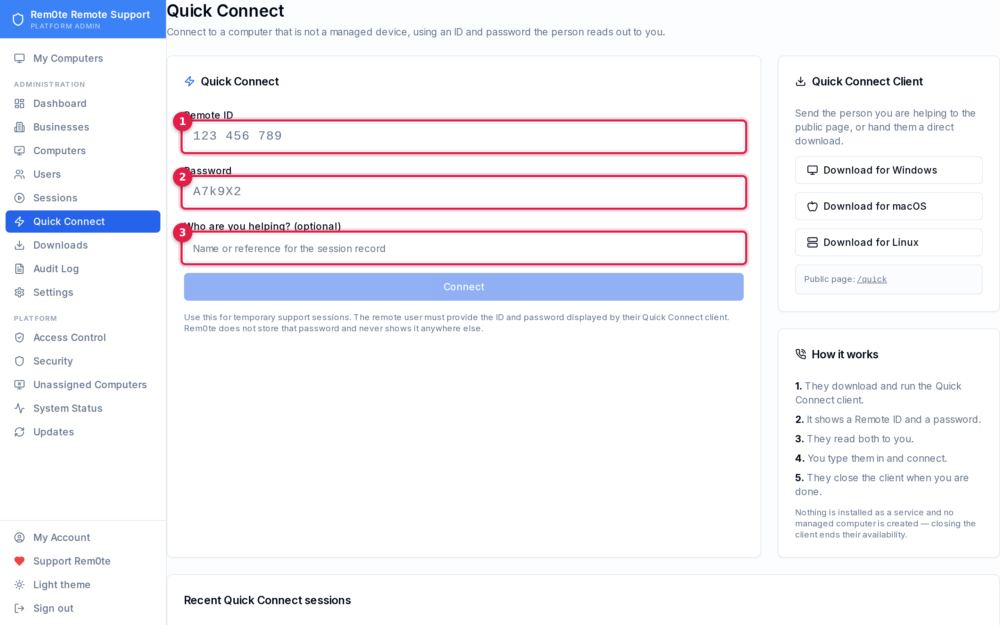
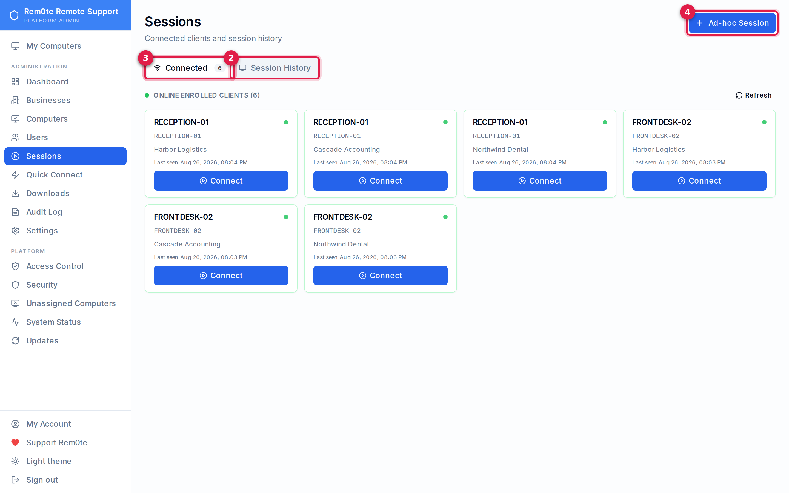
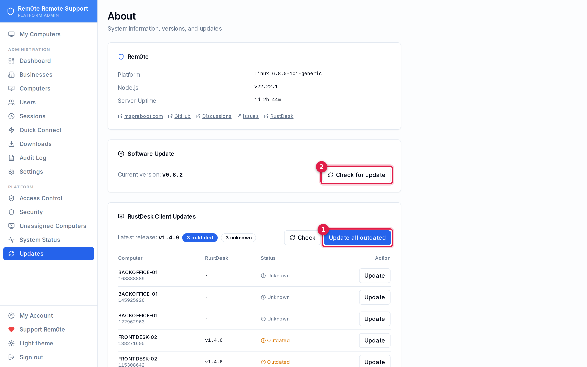

# Technician Guide

Day-to-day use of Rem0te: finding a computer, connecting to it, helping someone
who is not enrolled, and keeping the remote-control client current.

Screenshots are captured from a seeded demo instance. Every business, person and
computer in them is fictional.

> **Terminology.** A **Business** is a customer organisation and is the security
> boundary — a Business User only ever sees computers belonging to their
> business. A **Computer** (also called an endpoint or enrolled client) is a
> machine with the Rem0te agent permanently installed. See
> [access-control.md](access-control.md) for who can do what.

---

## 1. Sign in

1. Your email address.
2. Your password.
3. Sign in.

If your account has two-factor authentication enabled you are asked for a code
next. Recovery codes work here too, and each one is single-use.

---

## 2. Find a computer

**Computers** lists every machine enrolled in the businesses you can see.

1. **Search** — filters by name or hostname as you type.
2. **The table** — Business tells you who the machine belongs to, RustDesk ID is
   its remote-control identity, Last Seen is the most recent agent check-in, and
   Status is Online or Offline.
3. **Enroll Client** — install the agent on a new machine (§5).
4. **Generate Enrollment Link** — a one-time link you can send to someone else to
   run themselves.

**Online means the agent checked in within the last 30 minutes.** The agent
heartbeats every 3 minutes, so a machine that has genuinely dropped shows Offline
a few minutes later, not instantly.

---

## 3. Connect to a computer

Open a computer from the list, then use **Connect**.

1. **Connect** — hands the machine's ID and password to your local RustDesk
   client and starts the session.

You do not need to type a password. Rem0te holds the credential for each machine
and passes it to RustDesk for you; if you are prompted for one, something is
wrong — see Troubleshooting below.

Requirements on your own workstation:

- RustDesk must be installed.
- Your RustDesk must be configured for **this** server. If it is pointed at the
  public RustDesk network it will look up the ID there and either fail to find it
  or reach a completely unrelated machine.

Every connection is written to the audit log with who connected, to what, and
when.

---

## 4. Help someone who is not enrolled

Use **Quick Connect** for one-off help where nothing should be installed
permanently — a machine you do not manage, or a person you are helping once.

1. **Remote ID** — the 9-digit number their Quick Connect client shows.
2. **Password** — the short code shown next to it.
3. **Who are you helping** — optional label for the session record.

Send them to the public download page (shown on the right of that screen), they
run the client, and they read you the two values. Nothing is installed as a
service and no managed computer is created — closing the client ends their
availability.

Rem0te does not store the Quick Connect password and never displays it again.

---

## 5. Enrol a new computer

From **Computers → Enroll Client** you get a one-line PowerShell command to run
on the target machine as Administrator. It installs RustDesk, points it at this
server, sets a managed password, and registers the machine.

The installer is safe to re-run; it reconfigures an existing install rather than
duplicating it.

**It will refuse to report success if the machine never reaches the server.** If
you see an error instead of a summary, read it — it prints the service state,
whether ports 443 and 21116 are reachable, and RustDesk's own log. Those are the
facts that distinguish a firewall problem from a service that is not running.

---

## 6. Review sessions

1. **Connected** — enrolled clients currently online, each with a direct Connect
   button.
2. **Session History** — past sessions with duration and disposition.
3. **Connect** — start a session with that machine.
4. **Ad-hoc Session** — record a session against a machine that is not enrolled.

A session that is started but never opens a client is marked failed after 30
minutes, so the active count reflects reality rather than accumulating every
attempt.

---

## 7. Keep RustDesk current

**Updates** covers two separate things: Rem0te itself, and the RustDesk client
installed on each managed computer.

1. **Update all outdated** — queues every machine that is behind.
2. **Check** — re-reads the latest RustDesk release.

Per-machine status reads:

| Status | Meaning |
| --- | --- |
| **Current** | On the latest release. |
| **Outdated** | Behind; an update can be queued. |
| **Unknown** | The machine has not reported a version yet. Endpoints enrolled before v0.8.2 only start reporting after their next installer run. |
| **Queued** | An update is staged and applies on the next check-in. |

Queued updates apply on the machine's next heartbeat, within about 3 minutes. An
offline machine applies it whenever it next checks in — nothing is lost. A queued
update clears only once the machine reports the target version, so a failed
install retries instead of silently disappearing.

---

## Troubleshooting

**A computer shows Offline but the person says it is on.**
Online is driven by the agent's 3-minute heartbeat, not by RustDesk. A machine
can be running fine while the heartbeat task is broken. Re-running the installer
reinstalls the task and will now tell you if the machine cannot reach the server.

**Connect says "wrong password".**
The credential Rem0te holds and the one the machine has are out of step, or your
own RustDesk resolved the ID on the public network and reached a different
machine. Check that your workstation's RustDesk points at this server first —
that is the more common cause and the more serious one.

**Connect says "ID does not exist".**
The machine is not registered with this server's rendezvous service. It is either
genuinely offline, or its RustDesk cannot reach the server even though the agent
can. Re-run the installer on it; the verification step now reports exactly which.

**A machine was reported "installed successfully" but never appears.**
That was possible before v0.8.2 and is not any more — the installer now refuses
to claim success unless the server confirms it has seen the machine.
